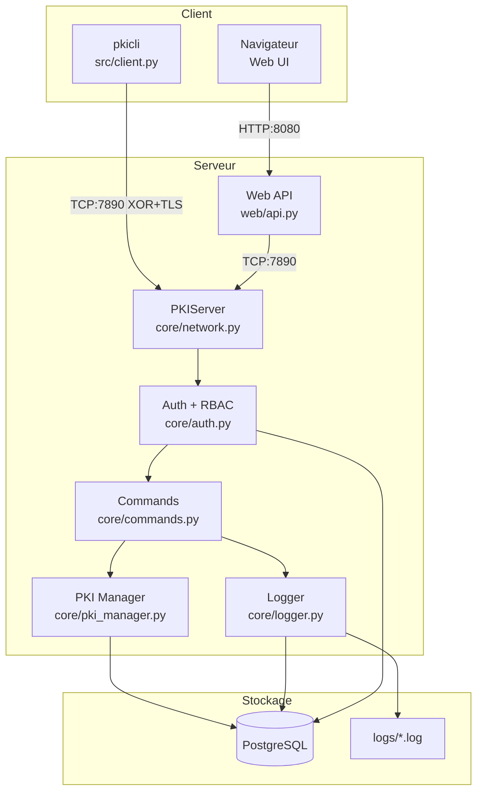
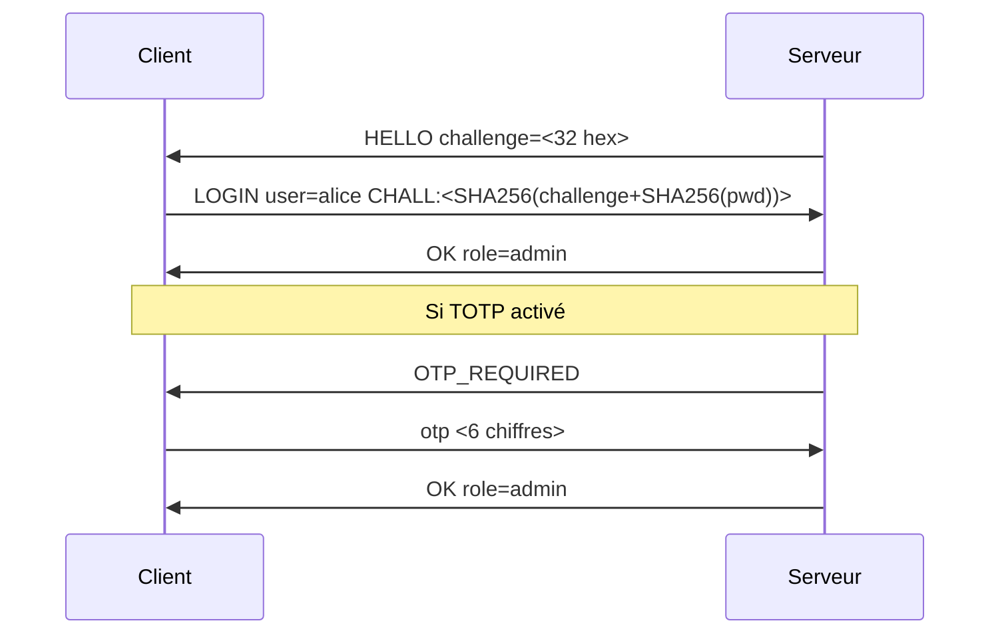
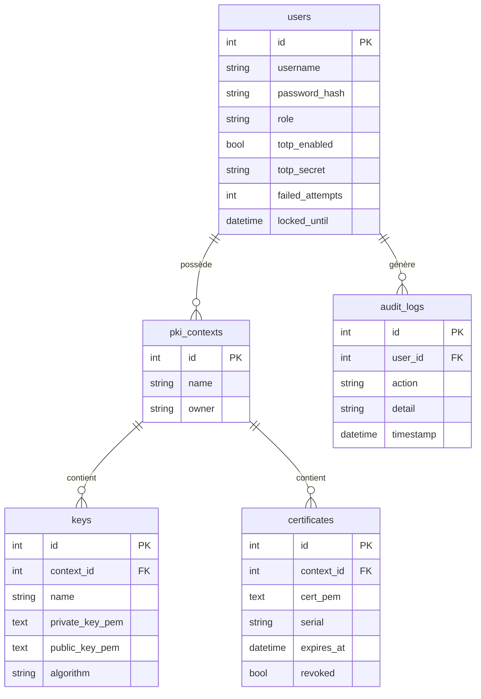

# Architecture

## Vue d'ensemble

Le système suit une architecture **client/serveur TCP** avec chiffrement de bout en bout.



## Protocole de communication

### Framing

Chaque message est encadré dans un format de **10 octets d'en-tête** suivi du payload chiffré :

```
┌──────────────┬─────────────────────────┐
│  10 octets   │     N octets             │
│  (taille)    │  (payload XOR chiffré)   │
└──────────────┴─────────────────────────┘
```

### Flux d'authentification



### Chiffrement XOR

```python
# Clé partagée via .env (XOR_KEY=42)
ciphertext[i] = plaintext[i] XOR key[i % len(key)]
```

## Base de données



## RBAC — Matrice de permissions

| Action | admin | editor | viewer |
|--------|:-----:|:------:|:------:|
| Gérer les utilisateurs | ✅ | ❌ | ❌ |
| Créer un contexte PKI | ✅ | ✅ | ❌ |
| Générer des clés | ✅ | ✅ (ses PKI) | ❌ |
| Signer des certificats | ✅ | ✅ (ses PKI) | ❌ |
| Révoquer des certificats | ✅ | ✅ (ses PKI) | ❌ |
| Lire les certificats | ✅ | ✅ | ✅ |
| Voir les logs | ✅ | ❌ | ❌ |
| Déverrouiller un compte | ✅ | ❌ | ❌ |

## Stack technique

| Composant | Technologie |
|-----------|-------------|
| Langage | Python 3.12 |
| Chiffrement | `cryptography` |
| Hash mots de passe | `argon2-cffi` (Argon2id) |
| TOTP | `pyotp` (RFC 6238) |
| Base de données | PostgreSQL + `psycopg2` |
| Interface web | Bootstrap 5 + JavaScript vanilla |
| Tests | `pytest` + `unittest.mock` |
| Conteneurisation | Docker Compose |
